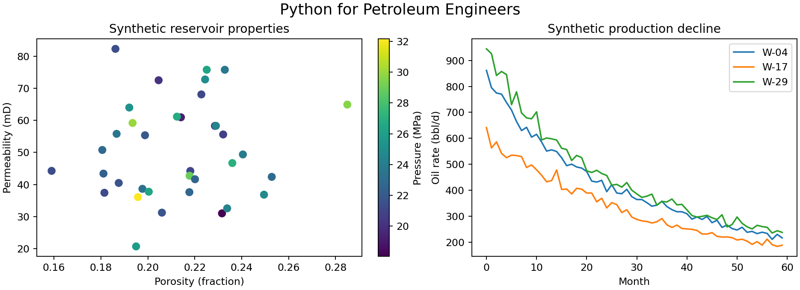

# Python for Petroleum Engineers

A practical, unit-aware Python course that teaches programming through reservoir,
petrophysics, core-analysis, PVT, production, and uncertainty examples. It is designed
for petroleum-engineering students who are new to Python and for engineers who want a
reproducible refresher.

This course grows from Bahareh Keshavarz's university teaching notebooks. It retains
their strongest ideas—core-cylinder geometry, Python collections, pressure and flow
conversions, porosity, permeability, Darcy flow, hydrocarbon volumes, pandas analysis,
and pressure-temperature-IFT plots—while rewriting them as documented, tested lessons.

## Learning outcomes

By completing the course, learners can:

- write readable Python functions and choose appropriate data structures;
- work safely with engineering units and vectorized NumPy calculations;
- clean, validate, summarize, and visualize reservoir tables with pandas;
- calculate porosity, hydrocarbon pore volume, volumetric OOIP, and linear Darcy flow;
- analyze synthetic PVT/IFT and production histories;
- quantify uncertainty with a reproducible Monte Carlo workflow; and
- combine multiple datasets in a small field-screening capstone.

## Course map

| Module | Notebook | Engineering focus |
|---:|---|---|
| 0 | Course overview | Reproducibility and data provenance |
| 1 | Python foundations | Core geometry, collections, loops, functions |
| 2 | NumPy, units, plots | Pressure, temperature, permeability, profiles |
| 3 | pandas | Well-table cleaning, filtering, grouping |
| 4 | Petrophysics and volumetrics | Porosity, HCPV, OOIP |
| 5 | Darcy flow | Forward calculation and inverse coreflood estimate |
| 6 | PVT and IFT data analysis | Tidy data, aggregation, visualization |
| 7 | Production decline | Exponential and hyperbolic decline |
| 8 | Uncertainty | Monte Carlo P10/P50/P90 |
| 9 | Capstone | Reproducible field screening |
| 10 | Original exercises reimagined | Corrected versions of Bahareh's exercises |

Start with [notebooks/00_course_overview.ipynb](notebooks/00_course_overview.ipynb).

## Quick start

    python -m venv .venv
    .venv\Scripts\activate
    python -m pip install -e .[dev]
    jupyter lab

On macOS or Linux, activate with source .venv/bin/activate.

Verify the complete course with:

    python -m pytest -q
    python scripts/execute_notebooks.py
    python scripts/check_repository.py

## Safe-data design

Every committed CSV is generated by this repository with a fixed random seed. The data
are plausible enough for teaching but do not describe a real field, well, company, or
commercial dataset.

## Important limitations

Examples prioritize clarity and software practice. They are not substitutes for a
reservoir simulator, laboratory interpretation, reserves audit, regulatory workflow,
or field-development decision. Synthetic trends are illustrative rather than calibrated
physical correlations.

## Licensing

Code is MIT licensed. Original narrative content and figures are CC BY-NC 4.0. See
LICENSE and CONTENT_LICENSE.md.
